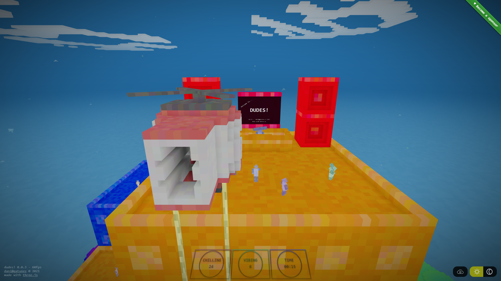

[dudes!](https://dudes.gatunes.com/)
==

[](https://dudes.gatunes.com/)

#### Live examples

 * Menu [demo](https://dudes.gatunes.com/) | [source](examples/scenes/menu.js)
 * DudeBrush: A VR sculpting tool with import/export [demo](https://dudes.gatunes.com/sculpt) | [source](examples/scenes/sculpt.js)
   * Multiplayer version: [demo](https://dudes.gatunes.com/sculptserver) | [source](examples/scenes/sculptserver.js)
 * A scene to debug the voxel updates, the physics contact callbacks and the dudes pathfinding. [demo](https://dudes.gatunes.com/debug) | [source](examples/scenes/debug.js)
   * Multiplayer version: [demo](https://dudes.gatunes.com/debugserver) | [source](examples/scenes/debugserver.js)
 * A helicopter gameplay where you help "The Chief" fly dudes up to the party. [demo](https://dudes.gatunes.com/heli) | [source](examples/scenes/heliparty.js)
 * A rave party where you can change the song by showing both thumbs down to "The Chief". [demo](https://dudes.gatunes.com/party) | [source](examples/scenes/party.js)
 * A worldgen happy accident [demo](https://dudes.gatunes.com/pit) | [source](examples/scenes/pit.js)
 * A stress test [demo](https://dudes.gatunes.com/stress) | [source](examples/scenes/stress.js)
 * Some state-of-the-art poop tech [demo](https://dudes.gatunes.com/poop) | [source](examples/scenes/poop.js)

#### Hello World / Boilerplate

```bash
# clone the boilerplate
git clone https://github.com/danielesteban/dudes-boilerplate.git
cd dudes-boilerplate
# install dev dependencies
npm install
# start the dev environment:
npm start
# open http://localhost:8080/ in your browser
```

#### Gameplay constructor options

```js
{
  world: {
    // For singleplayer
    chunkSize: 16,   // Size of the rendering chunks (default: 16)
    scale: 0.5,      // Scale of the rendering chunks (default: 0.5)
    width: 256,      // Volume width (should be a multiple of the chunkSize)
    height: 64,      // Volume height (should be a multiple of the chunkSize)
    depth: 256,      // Volume depth (should be a multiple of the chunkSize)
    seaLevel: 6,     // Sea level used in the generation and pathfinding
    seed: 987654321, // Uint32 seed for the rng. Will use a random one if undefined
    // Built-in generators
    generator: 'default', // 'blank', 'default', 'menu', 'debugCity', 'partyBuildings', 'pit'
    // Custom generator
    generator: (x, y, z) => (y < 6 ? { type: 'stone', r: 0xFF, g: 0, b: 0 }),

    // For multiplayer
    server: 'ws://localhost:8081/', // Server url

    // This will be called on every voxels contact if the physics are enabled
    onContact: (contact) => {},
  },
  dudes: {
    searchRadius: 64, // The search radius for the pathfinding
    spawn: {
      count: 32, // Number of dudes to initially spawn (default: 0)
      radius: 64, // The search radius for the spawn algorithm (default: 64)
      // Optional origin for the spawn algorithm.
      // It defaults to the center of the world if undefined
      origin: { x: 0, y: 0, z: 0 },
    },
    // This will be called on every dudes contact if the physics are enabled
    onContact: (contact) => {},
  },
  ambient = {
    range: { from: 0, to: 128 }, // Ambient sounds altitude range (in meters)
    sounds: [
      {
        url: '/sounds/sea.ogg', // Public url of the sound
        from: 0,                // Normalized altitude range
        to: 0.75,
      },
      {
        url: '/sounds/forest.ogg',
        from: 0.25,
        to: 1,
      },
    ],
  },
  explosionSound: '/sounds/blast.ogg', // Public url of the explosion sound
  projectileSound: '/sounds/shot.ogg', // Public url of the projectile shooting sound
  rainSound: '/sounds/rain.ogg',       // Public url of the rain sound
  explosions: false,  // Enable explosions (default: false)
  physics: true,      // Enable physics (default: true)
  projectiles: false, // Enable projectiles (default: false)
  lightToggle: false, // Enable light toggle UI (default: false)
  rainToggle: false,  // Enable rain toggle UI (default: false)
}
```

#### Gameplay overridable functions

```js
onLoad(options) {
  super.onLoad(options);
  // Do the things you want to do at construction
  // but require the world to be loaded/generated here
}

onUnload() {
  super.onUnload();
  // Dispose additional geometries/materials you created here
}

onAnimationTick({ animation, camera, isXR }) {
  const { hasLoaded } = this;
  super.onAnimationTick({ animation, camera, isXR });
  if (!hasLoaded) {
    return;
  }
  // Do input handling and custom animations here
  // This runs right after the physics and before the rendering
}

onLocomotionTick({ animation, camera, isXR }) {
  const { hasLoaded } = this;
  if (!hasLoaded) {
    return;
  }
  // You can use this to implement a custom locomotion
  // This runs right before the physics
}
```

#### Gameplay helper functions

```js
spawnProjectile(
  position = { x: 0, y: 0, z: 0 },
  impulse = { x: 0, y: 10, z: 0 },
);

spawnExplosion(
  position = { x: 0, y: 0, z: 0 },
  color = new Color(),
  scale = 0.5
);

updateVoxel(
  brush = {
    color: new Color(),
    noise: 0.1,    // color noise
    type: 'stone', // block type
    shape: 'box',  // 'box', 'sphere' 
    size: 1,       // brush radius
  },
  voxel = { x: 0, y: 0, z: 0 }
);
```

#### Multiplayer server

```bash
# clone this repo
git clone https://github.com/danielesteban/dudes.git
cd dudes/server
# install dev dependencies
npm install
# edit worlds config in server/main.js
# and start the server:
npm start
# set ws://localhost:8081/ as the server in the world config,
```

#### Engine dev dependencies

To build the C code, you'll need to install LLVM:

 * Win: [https://chocolatey.org/packages/llvm](https://chocolatey.org/packages/llvm)
 * Mac: [https://formulae.brew.sh/formula/llvm](https://formulae.brew.sh/formula/llvm)
 * Linux: [https://releases.llvm.org/download.html](https://releases.llvm.org/download.html)

On the first build, it will complain about a missing file that you can get here:
[libclang_rt.builtins-wasm32-wasi-12.0.tar.gz](https://github.com/WebAssembly/wasi-sdk/releases/download/wasi-sdk-12/libclang_rt.builtins-wasm32-wasi-12.0.tar.gz). Just put it on the same path that the error specifies and you should be good to go.

To build [wasi-libc](https://github.com/WebAssembly/wasi-libc), you'll need to install [GNU make](https://chocolatey.org/packages/make).

#### Engine local development

```bash
# clone this repo and it's submodules
git clone --recursive https://github.com/danielesteban/dudes.git
cd dudes
# build wasi-libc
cd vendor/wasi-libc && make -j8 && cd ../..
# install dev dependencies
npm install
# start the dev environment:
npm start
# open http://localhost:8080/ in your browser
```
