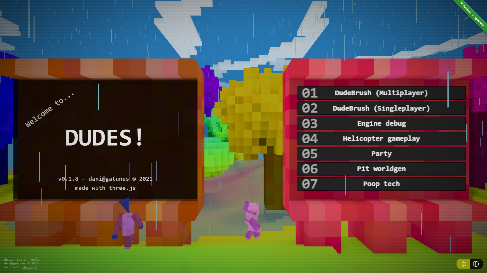

[dudes!](https://dudes.gatunes.com/)
==

[](https://dudes.gatunes.com/)

#### Live examples

 * Menu [demo](https://dudes.gatunes.com/) | [source](examples/scenes/menu.js)
 * DudeBrush: A VR sculpting tool with import/export [demo](https://dudes.gatunes.com/sculpt) | [source](examples/scenes/sculpt.js)
   * Multiplayer version: [demo](https://dudes.gatunes.com/sculptserver) | [source](examples/scenes/sculptserver.js)
 * A scene to debug the voxel updates, the physics contact callbacks and the dudes pathfinding. [demo](https://dudes.gatunes.com/debug) | [source](examples/scenes/debug.js)
   * Multiplayer version: [demo](https://dudes.gatunes.com/debugserver) | [source](examples/scenes/debugserver.js)
 * A helicopter gameplay where you help "The Chief" fly dudes up to the party. [demo](https://dudes.gatunes.com/heli) | [source](examples/scenes/heliparty.js)
 * A rave party where you can change the song by showing both thumbs down to "The Chief". [demo](https://dudes.gatunes.com/party) | [source](examples/scenes/party.js)
 * A worldgen happy accident [demo](https://dudes.gatunes.com/pit) | [source](examples/scenes/pit.js)
 * A stress test [demo](https://dudes.gatunes.com/stress) | [source](examples/scenes/stress.js)
 * Some state-of-the-art poop tech [demo](https://dudes.gatunes.com/poop) | [source](examples/scenes/poop.js)

#### Hello World / Boilerplate

  * [dudes-boilerplate](https://github.com/danielesteban/dudes-boilerplate)

  ```bash
  # clone the boilerplate
  git clone https://github.com/danielesteban/dudes-boilerplate.git
  cd dudes
  # install dev dependencies
  npm install
  # start the dev environment:
  npm start
  # edit 'scenes/helloworld.js'
  # open http://localhost:8080/ in your browser
  ```

#### Engine dev dependencies

To build the C code, you'll need to install LLVM:

 * Win: [https://chocolatey.org/packages/llvm](https://chocolatey.org/packages/llvm)
 * Mac: [https://formulae.brew.sh/formula/llvm](https://formulae.brew.sh/formula/llvm)
 * Linux: [https://releases.llvm.org/download.html](https://releases.llvm.org/download.html)

On the first build, it will complain about a missing file that you can get here:
[libclang_rt.builtins-wasm32-wasi-12.0.tar.gz](https://github.com/WebAssembly/wasi-sdk/releases/download/wasi-sdk-12/libclang_rt.builtins-wasm32-wasi-12.0.tar.gz). Just put it on the same path that the error specifies and you should be good to go.

To build [wasi-libc](https://github.com/WebAssembly/wasi-libc), you'll need to install [GNU make](https://chocolatey.org/packages/make).

#### Engine local development

```bash
# clone this repo and it's submodules
git clone --recursive https://github.com/danielesteban/dudes.git
cd dudes
# build wasi-libc
cd vendor/wasi-libc && make -j8 && cd ../..
# install dev dependencies
npm install
# start the dev environment:
npm start
# open http://localhost:8080/ in your browser
```
